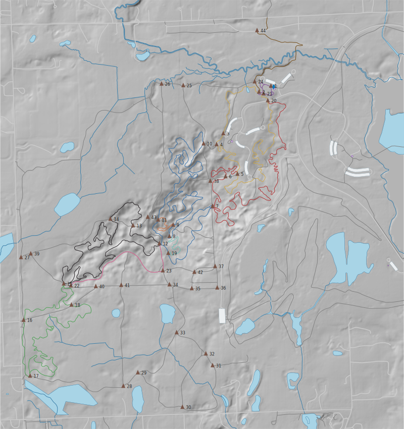

# osm_to_ai

A Python script that converts OpenStreetMap data into layered SVG files compatible with Adobe Illustrator.

OSM features are organized into proper Illustrator layers, trail routes are grouped and colored by their OSM relation, and an optional hillshade layer can be generated from elevation data.

Except for this line, the script and README was 100% written by Claude Code in an exercise with two goals: making my mapping work easier and becoming more comfortable working with AI coding tools. I consider this a success.

## Example

Stony Creek Metropark, Michigan — trails, water, roads, hillshade:

```
python osm_to_ai.py --bbox=-83.126807,42.711193,-83.096595,42.734788 --fetch-dem --output stony.svg
```



## Features

- **Three input modes** — local `.osm` file, bounding box (auto-fetched from Overpass API), or custom Overpass QL query file
- **Illustrator-native layers** — uses the Adobe Illustrator SVG namespace so layers appear in the Layers panel, not as groups
- **Trail relations** — each named OSM route relation becomes its own sublayer, colored by the relation's `colour=` tag (grey if untagged)
- **Water & roads** — classified and separated into sublayers automatically, including railroad tracks and disused railroads
- **Utilities** — power lines and tower icons in a dedicated layer
- **Information nodes** — `tourism=information` nodes rendered as symbols: guideposts with a labelled triangle, map boards with a blue "i" marker
- **Amenity nodes** — drinking water, bicycle repair stands, toilets, and parking rendered as distinct icons
- **Hillshade** — generate a hillshade layer from a local GeoTIFF DEM, or download one automatically from the USGS 3DEP service
- **Overpass retry logic** — automatically retries on 429/504 errors with exponential backoff
- **No GIS software required** — pure Python, no GDAL command-line tools needed (rasterio handles projection internally)

## Layer structure

Layers are only emitted when the loaded data contains matching features. The Hillshade layer additionally requires `--dem` or `--fetch-dem`.

```
Hillshade          (requires --dem or --fetch-dem)
Water
  ├─ Water Areas
  ├─ Waterways
  └─ [named water body relations]
Utilities
  ├─ Power Lines
  └─ Power Towers
Roads
  ├─ Major Roads
  ├─ Minor Roads
  ├─ Railroad Tracks
  └─ Disused Railroad
Trails
  ├─ [named trail relation]
  ├─ [another named trail relation]
  └─ Unnamed Paths
Information
  ├─ Guideposts
  └─ Map Boards
Amenities
  ├─ Drinking Water
  ├─ Bicycle Repair
  ├─ Toilets
  └─ Parking
```

## Requirements

```
pip install requests
```

For hillshade support (`--dem` or `--fetch-dem`):

```
pip install rasterio numpy Pillow
```

Python 3.8+ is required.

## Usage

### From a local .osm file

```
python osm_to_ai.py --file input.osm --output map.svg
```

### From a bounding box (fetches from Overpass API)

```
python osm_to_ai.py --bbox="-105.28,40.01,-105.25,40.03" --output map.svg
```

> **Note:** Use `--bbox=` (with `=`) when your bounding box contains negative numbers, to prevent argparse from misreading the leading `-` as a flag.

### From a custom Overpass QL query file

```
python osm_to_ai.py --overpass query.overpassql --output map.svg
```

### With hillshade from a local GeoTIFF DEM

```
python osm_to_ai.py --file input.osm --dem elevation.tif --output map.svg
```

The DEM can be in any coordinate reference system — the script reprojects it to Web Mercator automatically.

### With hillshade downloaded automatically from USGS 3DEP

```
python osm_to_ai.py --bbox="-105.28,40.01,-105.25,40.03" --fetch-dem --output map.svg
```

The downloaded DEM is saved as a sidecar `.tif` file next to the output (e.g. `map_dem.tif`) and reused on subsequent runs.

## All options

| Option | Default | Description |
|---|---|---|
| `--file PATH` | — | Read from a local `.osm` file |
| `--bbox BBOX` | — | Fetch from Overpass for `min_lon,min_lat,max_lon,max_lat` |
| `--overpass FILE` | — | Read an Overpass QL query from a file |
| `--output PATH` | *(required)* | Output `.svg` file |
| `--width PX` | `800` | SVG width in pixels (height is proportional) |
| `--dem PATH` | — | Local GeoTIFF DEM for hillshade |
| `--fetch-dem` | — | Download a DEM from USGS 3DEP automatically |
| `--dem-resolution METERS` | `3` | DEM pixel size in metres (`1` = lidar, `3` = 1/9″, `10` = 1/3″) |
| `--sun-azimuth DEGREES` | `315` | Sun direction, clockwise from north (315 = northwest) |
| `--sun-altitude DEGREES` | `45` | Sun angle above the horizon |
| `--save-osm PATH` | — | Save the downloaded OSM XML to a file for later reuse with `--file` |

## Trail coloring

Trails are colored by the `colour=` or `color=` tag on their OSM route relation. Any valid CSS color value (hex, named, etc.) works. Trails not belonging to any named relation, or relations without a color tag, are drawn in 50% grey.

To set a color on a relation in OSM, add a tag like:

```
colour = #e8321a
```

## OSM route relation types recognized

`hiking`, `foot`, `bicycle`, `mtb`, `horse`, `trail`

Ways with `highway=path/footway/cycleway/bridleway/steps/track` that are members of these relations are included in the trail layer. Ways not part of any relation appear in the *Unnamed Paths* sublayer.

## Information nodes

Nodes tagged `tourism=information` are rendered in a top *Information* layer, above all other features.

| OSM tags | Rendered as |
|---|---|
| `information=guidepost` + `name=*` or `ref=*` | Brown upward triangle with a text label |
| `information=map` | Blue rectangle with a white "i" glyph |

Guideposts without a `name=` or `ref=` tag are omitted (there is nothing to label). Other `information=` values (e.g. `board`, `office`) are currently ignored.

## Amenity nodes

Nodes tagged with the following `amenity=` values are rendered in a top *Amenities* layer.

| OSM tag | Icon |
|---|---|
| `amenity=drinking_water` | Blue teardrop |
| `amenity=bicycle_repair_stand` | Green two-wheel bicycle outline |
| `amenity=toilets` | Purple rectangle with white "WC" (node), or light-purple filled area (closed way) |
| `amenity=parking` | Dark-blue rectangle with white "P" (node), or light-grey filled area (closed way) |

Each type appears in its own sublayer. Where an amenity is mapped as a closed way (area), the filled polygon is drawn first with the icon centred on any co-located node on top. Only sublayers that contain at least one feature are emitted.

## USGS 3DEP coverage

`--fetch-dem` downloads elevation data from the [USGS 3DEP ImageServer](https://elevation.nationalmap.gov/arcgis/rest/services/3DEPElevation/ImageServer). Coverage is primarily the United States. For areas outside the US, download a GeoTIFF DEM separately (e.g. from [OpenTopography](https://opentopography.org)) and use `--dem`.

## Tips

- **Large areas** can time out on the Overpass API. Consider exporting an `.osm` file from [JOSM](https://josm.openstreetmap.de) or [Overpass Turbo](https://overpass-turbo.osm.ch) and using `--file` instead.
- **Windows users** should use `python` (not `python3`) when running inside a virtual environment.
- The SVG output opens directly in Adobe Illustrator with layers intact. In Illustrator, choose *File → Open* (not *Place*).

## Authors

- **Steve Vigneau** — [steve@nuxx.net](mailto:steve@nuxx.net)
- **Claude** (Anthropic) — AI assistant

## License

MIT License — see [LICENSE](LICENSE) for the full text.

Copyright (c) 2026 Steve Vigneau
